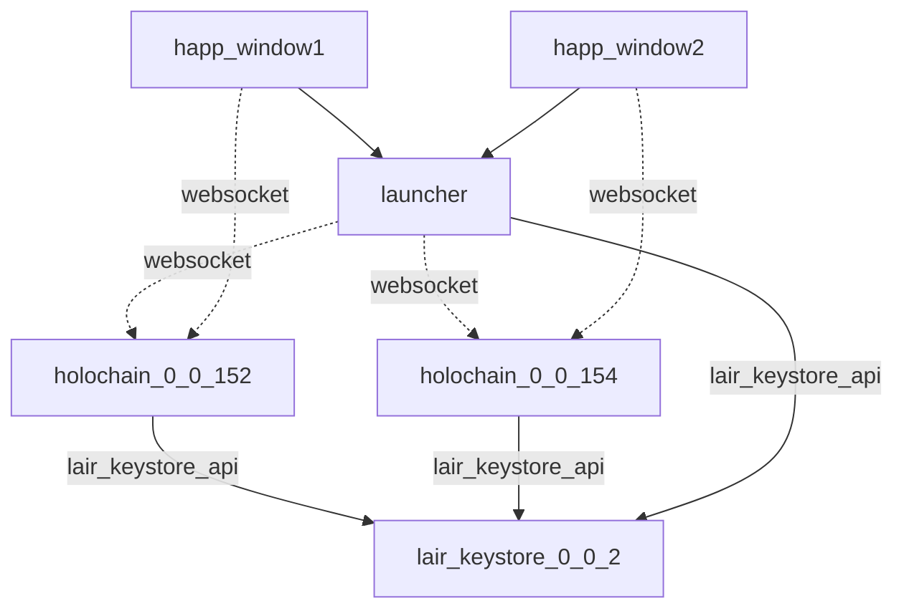
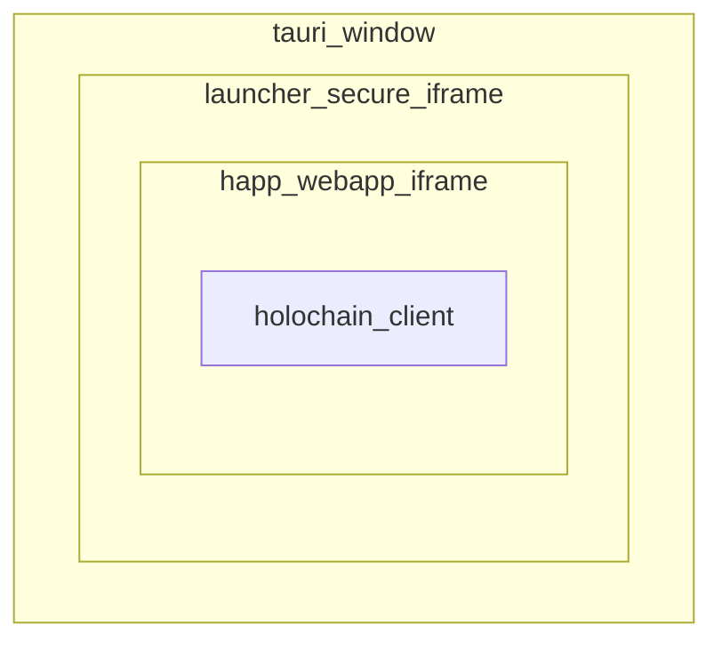
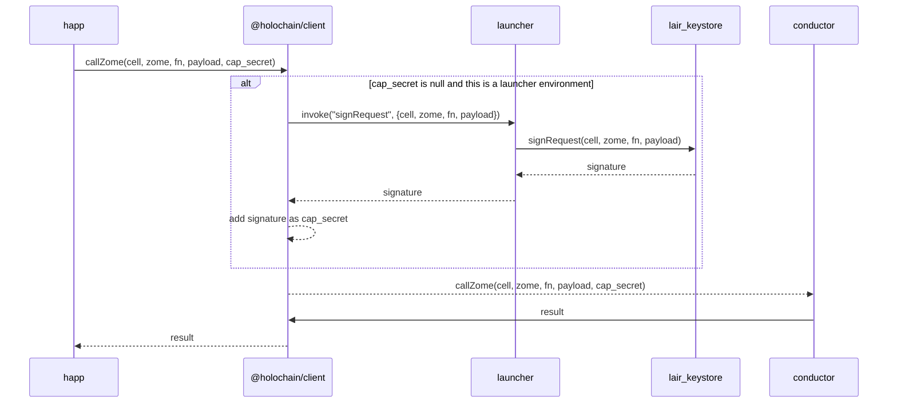
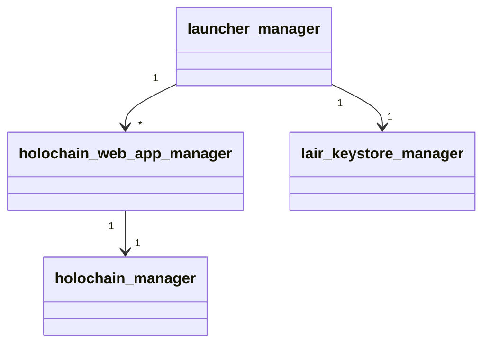

# Architecture

## Runtime components

- [Lair](https://github.com/holochain/lair): stores the private keys, has to be unlocked using a "master" password.
- [Holochain](https://github.com/holochain/holochain): conductor for a particular holochain version.
- Happ windows: tauri windows

### Happ tauri window

## Signing a Zome Call

## Code components

A manager is something that given a path, instantiates and manages an external process (usually a tauri sidecar binary).

High-level functions:

- lair_keystore_manager: given a path to a folder, run a lair_keystore instance in that folder and maintain an active connection to it to:
  - Sign zome calls

- holochain_manager: given a path to a config folder and a path to a data folder, run and manage a holochain instance that installs apps in that path.

- holochain_web_app_manager: given a path to a config folder and a path to a data folder, run and manage a holochain_manager for `${DATA_FOLDER}/conductor` and also the UIs for the apps installed in that conductor in `${DATA_FOLDER}/ui`.

- launcher_manager: given a path to a config folder and a path to a data folder, run and manage multiple holochain_web_app_manager for all the different supported versions and also a lair_keystore_manager.

